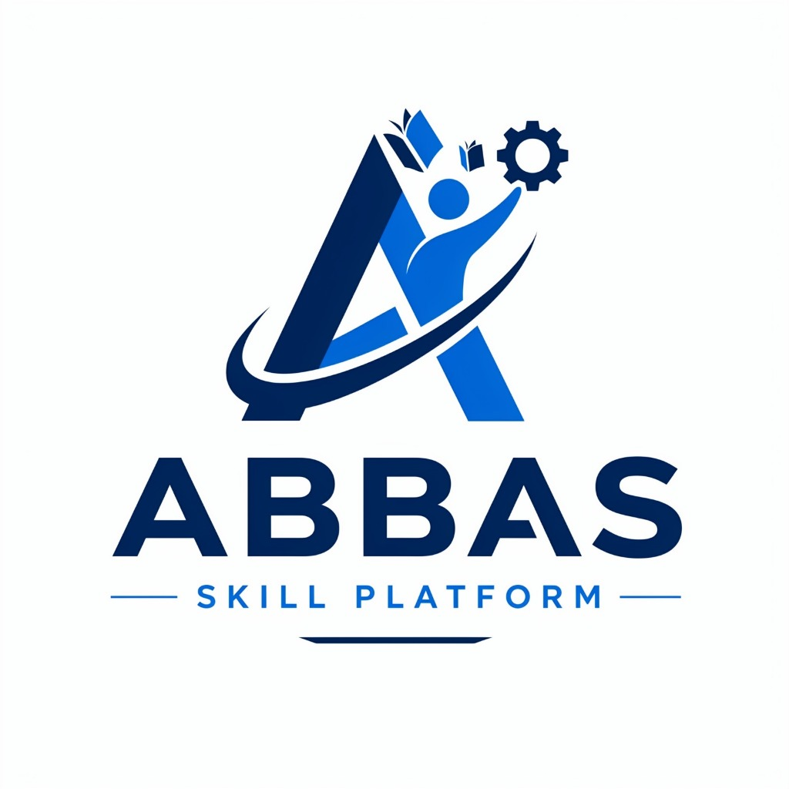

# Abbas Skill Platform — Full Stack Development Course 🚀

<p align="center">
  
</p>

A modern, responsive e-learning web platform for Full Stack Development by **Abbas Skill Platform**, featuring dual-language instruction in **Hindi** and **Tamil**.

## 🌟 Features

- **160+ Interactive Lessons**: Comprehensive video lectures and hands-on quizzes curated across 16 weeks of curriculum.
- **Bilingual Video Player**: Seamless toggle between **Hindi** and **Tamil** for every video lesson and quiz.
- **Dark Premium Aesthetic**: Executive royal sapphire blue theme with smooth transitions, glow accents, and responsive layout across all device viewports.
- **Mobile-First Experience**: Off-canvas curriculum drawer, sticky quick-navigation bar, and safe-area insets.
- **Interactive Quizzes**: Direct embedded links to test your skills at each milestone.
- **Progress Tracking**: Local storage-backed progress bar and completion checkmarks.

## 📚 Curriculum Outline

1. **AspiraSys Intro & Career Guidance**
2. **Web Basics & Developer Tools** (VS Code, Git & GitHub, Netlify)
3. **HTML5 Mastery**
4. **CSS3 & Responsive Design**
5. **Modern JavaScript (ES6+)**
6. **React.js & State Management**
7. **Python Programming & Backend Fundamentals**

## 💻 Getting Started Locally

Simply open `index.html` in any modern web browser or serve it locally:

```bash
# Using Python
python -m http.server 3000

# Using Node.js
npx serve .
```

Then visit [http://localhost:3000](http://localhost:3000).

## 📄 License

MIT License — feel free to use and customize for your own learning platform.
